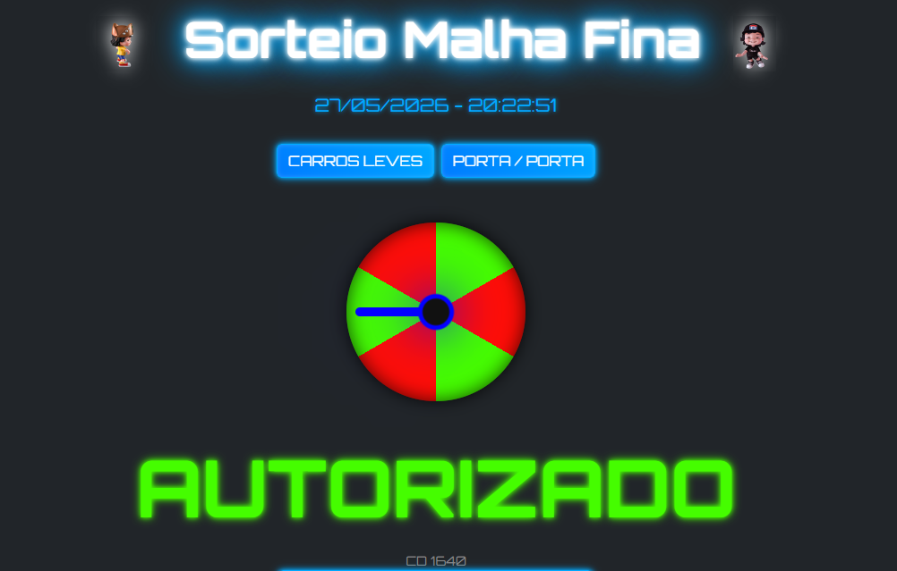

# Sorteio-Malha-fina
Aplicação visual de sorteio ("Malha Fina" vs "Liberado") desenvolvida com Python e Flask. Possui interface inspirada em estética Cyberpunk/Neon, com animações complexas, física de partículas e feedback imersivo. Funciona como Desktop ou Web App.

<div align="center">
  
</div>

# 🎲 Sorteio Visual - Malha Fina

Uma aplicação interativa de alta fidelidade desenvolvida em **Python (Flask)** para sorteios aleatórios. O sistema utiliza uma estética Cyberpunk para indicar se um veículo foi **"Liberado"** (Verde) ou se deve **"Seguir para Malha"** (Vermelho).

Ideal para controle de fluxo, auditorias aleatórias, dinâmicas de grupo ou qualquer cenário que precise de um sorteio visual e divertido.

## 🚀 Funcionalidades

*   **Roleta 3D com Perspectiva:** Interface modernizada com profundidade 3D, bordas neon e inclinação dinâmica.
*   **Veículo Animado Reativo:**
    *   **Sucesso:** O veículo cruza a tela em alta velocidade com som de motor e faíscas neon verdes.
    *   **Malha:** O veículo freia bruscamente, deixa marcas de pneu no asfalto, emite fumaça e ativa sirenes de polícia.
    *   **Explosão:** Efeito de partículas para resultados críticos ("Você Malhou").
*   **Feedback Imersivo Total:**
    *   **Visual:** Tremor de interface, pulsação de fundo em vermelho e explosão de partículas sincronizadas.
    *   **Sonoro:** Efeitos de "tick" que desaceleram, som de frenagem, impacto e motor gerados via Web Audio API.
*   **Voz Robótica Futurista:** Síntese de voz (Web Speech API) processada para soar mecânica e imponente.
*   **Temas Visuais:** Alterne com um clique entre o tema **Futurista** (neon, escuro) e o tema **Clássico** (padrão). A escolha é salva no navegador.
*   **Painel Administrativo:** Área restrita (login) para adicionar, editar ou remover os botões de sorteio.
*   **Persistência de Dados:** Gerenciamento robusto via **SQLAlchemy**, permitindo uso de SQLite local ou bancos PostgreSQL em produção.
*   **Sorteio Direcionado (Easter Egg):** Clique na metade esquerda da tela para forçar o próximo resultado como "Liberado" ou na metade direita para "Malha Fina".
*   **Híbrido:** Pode rodar como um site na web ou como um aplicativo Desktop (executável Windows).

## 🛠️ Tecnologias Utilizadas

*   **Backend:** Python 3, Flask, SQLAlchemy (ORM)
*   **Frontend:** HTML5, CSS3 (Animações 3D/Keyframes), JavaScript (ES6+), Bootstrap 5
*   **Deploy/Build:** Gunicorn (Web), PyInstaller (Desktop)
*   **Áudio/Voz:** Web Audio API (Sintetizadores dinâmicos), Web Speech API

## 📸 Screenshots

### Demonstração de Uso


### Interface Administrativa
<div align="center">
  
</div>

## ⚙️ Como Rodar Localmente

1.  **Clone o repositório:**
    ```sh
    git clone https://github.com/SEU-USUARIO/NOME-DO-REPO.git
    cd NOME-DO-REPO
    ```

2.  **Instale as dependências:**
    ```bash
    pip install -r requirements.txt
    ```

3.  **Execute a aplicação:**
    ```bash
    python app.py
    ```
    O sistema estará acessível em `http://localhost:5000`.

## 🖥️ Como Gerar Executável (Windows)

Para criar um arquivo `.exe` standalone que não precisa de Python instalado na máquina cliente:
```bash
pip install pyinstaller
pyinstaller --noconsole --onefile --icon=static/img/icon.ico --add-data "templates;templates" --add-data "static;static" app.py
